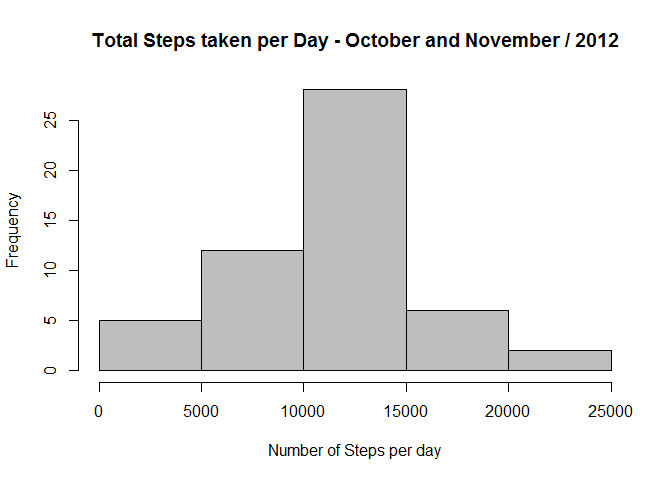
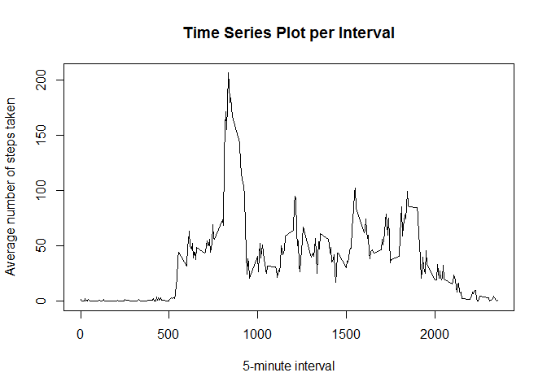
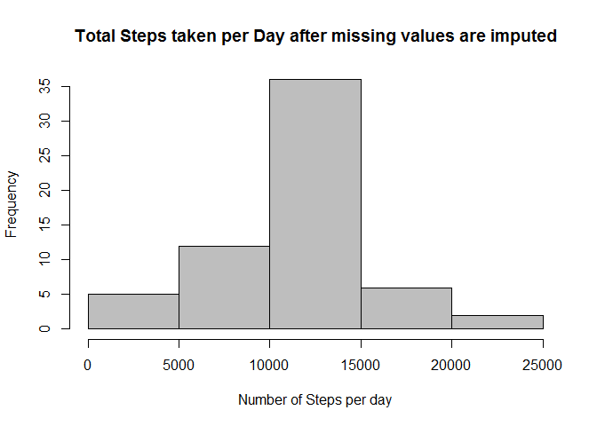
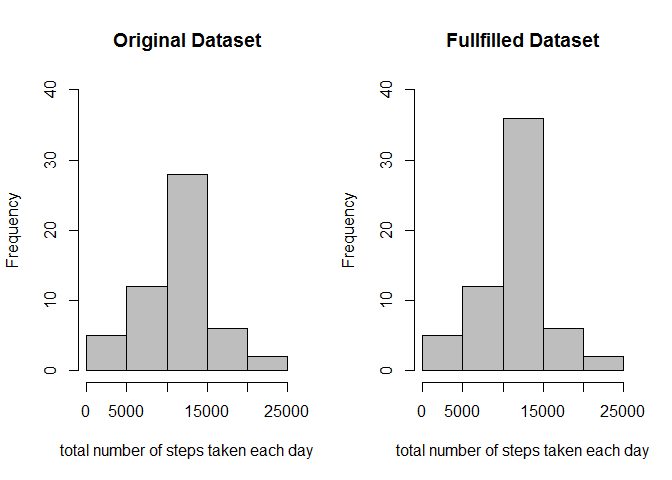

# Reproducible Research: Peer Assessment 1
mpmartins1970  
2016/02/29  

********************************************************************************

Loading and preprocessing the data
--------------------------------------------------------------------------------

### 1. Load the data 


```r
# Load full dataset
activity <- read.csv(
        file = "activity.csv",
        header = TRUE,
        sep = ",", 
        na.strings = "NA"
)
```

### 2. Process/transform the data into a format suitable for the analysis


```r
# Convert in a Date class column
activity$date <- as.Date(activity$date, format = "%Y-%m-%d")
```

********************************************************************************

What is mean total number of steps taken per day?
--------------------------------------------------------------------------------

_For this part of the assignment, you can ignore the missing values in
the dataset._


```r
# Create dataset without missing values
activityComplete <- subset(activity, complete.cases(activity))

# Aggregate steps per day
stepsByDay <- aggregate(list(Steps = activityComplete$steps), 
                        by = list(Day = activityComplete$date), 
                        FUN = sum)
```

### 1. Histogram of the total number of steps taken each day


```r
hist(stepsByDay$Steps, 
     main = "Total Steps taken per Day - October and November / 2012",
     xlab = 'Number of Steps per day', col = 'grey'
     )
```



### 2. Calculate and report the **mean** and **median** total number of steps taken per day


```r
# Calculate Mean
meanStepsByDay = round(mean(stepsByDay$Steps), 1)

# Calculate Median
medianStepsByDay = round(median(stepsByDay$Steps), 1)
```

* **Mean** total number of steps taken per day: 

```
## [1] 10766.2
```
    
    
* **Median** total number of steps taken per day:


```
## [1] 10765
```


********************************************************************************

What is the average daily activity pattern?
--------------------------------------------------------------------------------


```r
# Aggregate steps per interval
stepsByInterval <- aggregate(list(Steps = activityComplete$steps), 
                        by = list(Interval = activityComplete$interval), 
                        FUN = mean)
```

1. Time series plot of the 5-minute interval (x-axis) and the average number of steps taken, averaged across all days (y-axis)


```r
# Time series plot
plot(stepsByInterval$Interval, stepsByInterval$Steps, 
     type = "l", 
     main = "Time Series Plot per Interval",
     xlab = "5-minute interval",
     ylab = "Average number of steps taken") 
```




2. Which 5-minute interval, on average across all the days in the dataset, contains the maximum number of steps?


```r
# Interval with maximum average number of steps
intervalMaxSteps <- stepsByInterval[which.max(stepsByInterval$Steps),]$Interval
```

* The 5-minute interval that, on average, contains the maximum number of steps: 

```
## [1] 835
```


********************************************************************************

Imputing missing values
--------------------------------------------------------------------------------

1. Calculate and report the total number of missing values in the dataset (i.e. the total number of rows with `NA`s)


```r
# Total number of missing values in the dataset
numNA <- nrow(activity[complete.cases(activity),])
```

* Total of missing values in the dataset:


```
## [1] 15264
```


2. Devise a strategy for filling in all of the missing values in the dataset. 

_I used a strategy for filing in all of the missing values with the median for that 5-minute interval_


```r
# Calculate mean steps per interval
meanByInterval <- aggregate(list(Mean = activityComplete$steps), 
                             by = list(interval = activityComplete$interval), 
                             FUN = mean)

# Merge datasets
activityFilled <- merge(activity, meanByInterval, by = "interval", sort = FALSE)

# Use Mean steps per interval to fill NA values
activityFilled$steps[is.na(activityFilled$steps)] <- activityFilled$Mean[is.na(activityFilled$steps)]
```

3. Create a new dataset that is equal to the original dataset but with the missing data filled in.


```r
activityNew <- activityFilled[,c(2,3,1)]
```


4. Make a histogram of the total number of steps taken each day and Calculate and report the **mean** and **median** total number of steps taken per day. Do these values differ from the estimates from the first part of the assignment? What is the impact of imputing missing data on the estimates of the total daily number of steps?


```r
# Aggregate steps per day
stepsByDayNew <- aggregate(list(Steps = activityNew$steps), 
                        by = list(Day = activityNew$date), 
                        FUN = sum)
```

### 1. Histogram of the total number of steps taken each day after missing values are imputed


```r
hist(stepsByDayNew$Steps, 
     main = "Total Steps taken per Day after missing values are imputed",
     xlab = 'Number of Steps per day', col = 'grey'
     )
```



### 2. Calculate and report the **mean** and **median** total number of steps taken per day after missing values are imputed


```r
# Calculate Mean
meanStepsByDayNew = round(mean(stepsByDayNew$Steps), 1)

# Calculate Median
medianStepsByDayNew = round(median(stepsByDayNew$Steps), 1)
```

* **Mean** total number of steps taken per day after missing values are imputed: 

```
## [1] 10766.2
```
    
    
* **Median** total number of steps taken per day after missing values are imputed:


```
## [1] 10766.2
```

### 3. Do these values differ from the estimates from the first part of the assignment? What is the impact of imputing missing data on the estimates of the total daily number of steps?


The new **Mean** calculated is equal to the value from the first part of the assignment.

The new **Median** calculated shows a little difference when compared to the first part of the assignment.  

The new histogram shows a similar shape when compared with the first one, as presented below:


```r
par(mfrow = c(1,2))

hist(stepsByDay$Steps, 
     main = "Original Dataset",
     xlab = "total number of steps taken each day", 
     col = "grey", ylim = c(0,40))

hist(stepsByDayNew$Steps, 
     main = "Fullfilled Dataset",
     xlab = "total number of steps taken each day", 
     col = "grey", ylim = c(0,40))
```




********************************************************************************

Are there differences in activity patterns between weekdays and weekends?
--------------------------------------------------------------------------------


```r
# Create a new dataset to analyze activity patterns between weekdays and weekends
activityWeek <- activityNew

# Identify Day of the Week
activityWeek$wday <- c("Sunday", "Monday", "Tuesday", "Wednesday", "Thursday", 
                    "Friday", "Saturday")[as.POSIXlt(activityWeek$date)$wday + 1]

# Classify Weekend (Saturday,Sunday) / Weekday (Monday, Tuesday, Wednesday, Thursday, Friday)
activityWeek$tday <- c("Weekend", "Weekday", "Weekday", "Weekday", "Weekday", 
            "Weekday", "Weekend")[as.POSIXlt(activityWeek$date)$wday + 1]
```


## 1. Panel plot comparing the average number of steps taken per 5-minute interval across weekdays and weekends


```r
# Aggregate steps per interval in type of the day (weekday/weekend)
stepsByIntervalWeek <- aggregate(list(Steps = activityWeek$steps), 
                             by = list(Interval = activityWeek$interval, TDay = activityWeek$tday), 
                             FUN = mean)

# Panel plot comparing the average number of steps taken per 5-minute interval across weekdays and weekends
library(lattice) 
xyplot(Steps ~ Interval | TDay, 
       data = stepsByIntervalWeek,
       layout = c(1,2), 
       type = "l",
       xlab = "Interval",
       ylab = "Number of steps")
```


********************************************************************************


